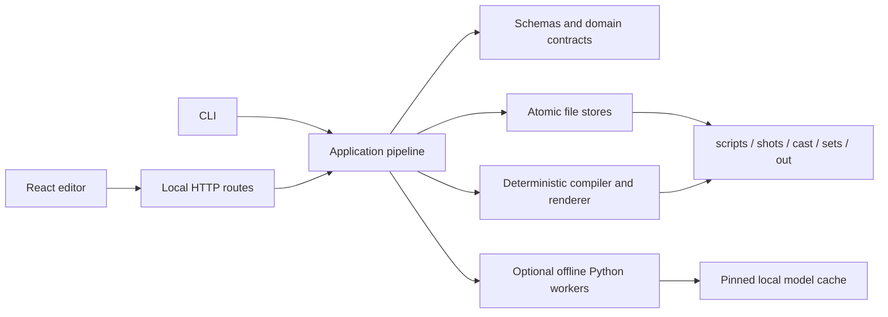

# Architecture

Animation Engine is a local-first TypeScript application with a React editor, a deterministic
rendering pipeline and optional Python model workers. Project documents on disk are the source of
truth; the UI and CLI are two clients of the same pipeline and schemas.



## Layers and ownership

| Layer          | Primary locations                           | Responsibility                                                        |
| -------------- | ------------------------------------------- | --------------------------------------------------------------------- |
| Domain         | `src/schema`, `src/contracts`, `src/show`   | Runtime schemas, exact shared types, identity and migrations          |
| Application    | `src/pipeline`, `src/direct`, `src/compile` | Use cases, directing, timeline construction and production checks     |
| Infrastructure | `src/server`, `src/core`, `src/*/store.ts`  | HTTP boundaries, paths, persistence, processes and model verification |
| Presentation   | `ui/src`, `src/cli`                         | Editor and command-line adapters; neither owns domain rules           |
| Rendering      | `src/render`, `src/voice`, Python workers   | Deterministic visual/audio output and optional local inference        |

The application pipeline is the integration point. New behavior should normally enter there and
be exposed through thin CLI or HTTP adapters, rather than being reimplemented in a route or React
component.

Large modules are split by stable responsibility:

- `src/compile/timeline.ts` owns editorial, audio, card and semantic-animation timing.
- `src/pipeline/preflight/motion.ts` owns resolved-motion and blocking quality checks.
- `src/server/routes/scene-media.ts` owns scene media, export and preparation endpoints.
- `src/server/routes/scene-soundtrack.ts` owns soundtrack job validation.
- `src/cli/args.ts` owns command-line parsing.
- `ui/src/editor/workspaceActions.ts` owns mode tools and editor keyboard behavior.

## Trust boundaries

Scene, cast, set and prop identifiers eventually become path segments. Every external identifier
must pass `projectId` and every derived path must remain inside its declared root through
`resolveWithin`. Encoded separators, traversal segments and malformed URI components are rejected
with a client error.

HTTP request bodies are bounded at 64 MiB. Static and media responses are streamed, and byte-range
requests reject malformed or unsatisfiable ranges with `416`. Routes that replace a document must
verify that its body identity matches the URL identity before writing.

Do not construct project paths directly in routes or components. Add new file-backed entity types
to the shared project-boundary helpers first.

## Persistence and document evolution

Project JSON, scripts and generated metadata use `atomicWriteFile`: write a uniquely named sibling
temporary file, then rename it into place. Readers therefore see either the previous complete file
or the next complete file, never a partial write.

Persisted shot lists, rigs and sets carry schema versions. Readers accept the pre-versioned shape
for backward compatibility; writers stamp the current version. `anim migrate` plans legacy changes
without writing by default, and applies them only with `--apply`.

Identity hashing lives in the Node-only `src/show/identity.ts`. Browser-safe identity schemas stay
free of Node built-ins so the UI contract graph remains portable.

## Shared contracts

`src/contracts/domain.ts` is the exact compile-time contract shared with the UI. Runtime API
documents use the Zod schemas exported through `ui/src/contracts.ts`; `ui/src/api.ts` validates
responses at the network boundary before application state receives them.

When adding an endpoint:

1. define or reuse its runtime schema in the domain layer;
2. derive the TypeScript type from that schema or the shared domain contract;
3. validate route input, including URL/body identity;
4. validate the response in the UI API adapter;
5. add a route-boundary test for invalid input and a happy path.

## Model supply chain

Optional neural workers run with offline environment flags and never fetch weights during a job.
`config/models.manifest.json` is the allow-list for production artifacts: model id, immutable
revision, license, local files and SHA-256 checksums. `anim doctor` reports manifest status and the
CLI verification path checks file hashes. Python dependencies are captured in
`requirements-python.lock.txt`.

Changing a model requires a deliberate manifest update, license review, fresh independent hashes
and the model-manifest tests. A mutable branch or tag is not an acceptable production revision.

## Verification

The normal local handoff gate is:

```bash
npm run verify
```

The CI gate runs formatting, zero-warning ESLint, root and UI type checks, Vitest with enforced
coverage thresholds, a production Vite build and a real Chromium smoke test. A separate Linux job
compiles Python sources and runs dependency-free worker tests.

Current repository-wide coverage floors are 70% statements, 65% branches, 70% functions and 73%
lines. Raise them as untested infrastructure gains focused tests; do not lower them to accommodate
new code.

For boundary-sensitive changes, also run:

```bash
npm run test:coverage
npm run test:browser
npm run test:python
npm audit
npm audit --prefix ui
```

## Extension rules

- Keep domain behavior out of HTTP handlers and React components.
- Preserve deterministic output: derive randomness from named seeded streams.
- Make persisted writes atomic and schema-versioned.
- Treat all route parameters, request bodies and model output as untrusted.
- Keep Node-only modules out of browser-reachable schemas and contracts.
- Prefer a focused module once a file owns more than one independently testable responsibility.
- Add regression tests at the narrowest layer and an integration test when a boundary changes.
